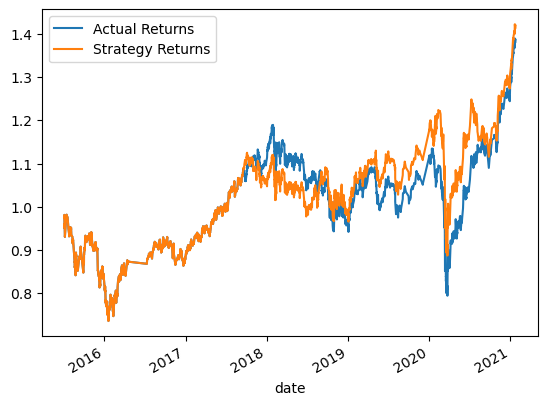
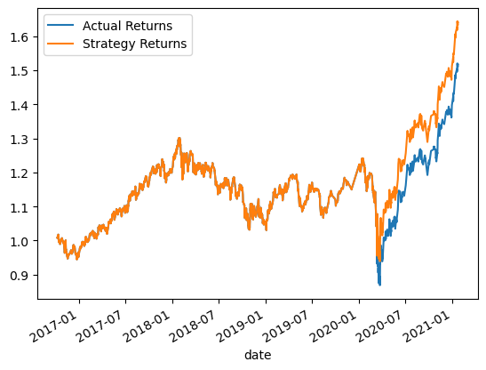
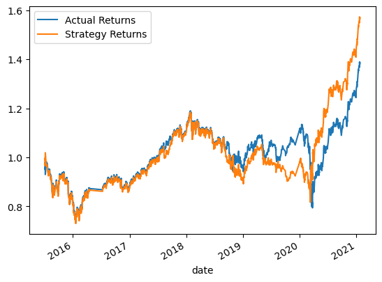
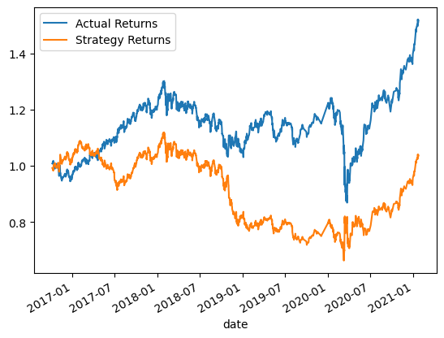
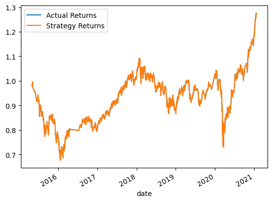
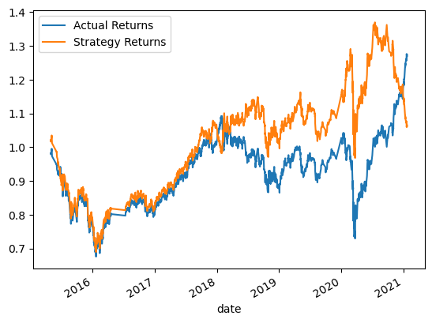

# Machine-Learning-Trading-Bot
Enhancing algorithmic trading systems using machine learning. I establish a baseline performance, tune the trading algorithm by adjusting parameters, evaluate a new machine learning classifier, and create an evaluation report. Results are summarized in the README.md file with PNG images for analysis.

### Impact of Increasing Training Window

#### Support Vector Classifier (SVC)

When the training window was increased from 3 months to 18 months, the SVC classifier performed better with the new training dataset. The following plots demonstrate the difference in performance:

##### Training Window: 3 Months

##### Training Window: 18 Months

The results indicate that the increased training window allowed the SVC classifier to capture more historical patterns and make more accurate predictions.

#### AdaBoost Classifier

Contrary to the SVC classifier, the AdaBoost classifier performed worse with the new training dataset of 18 months. The following plots illustrate the difference in performance:

##### Training Window: 3 Months

##### Training Window: 18 Months

The results suggest that the AdaBoost classifier struggled to generalize well with the increased training window, potentially indicating overfitting or an imbalance between the historical patterns and the current market conditions.

## Impact of Changing SMA Rolling Periods

### Support Vector Classifier (SVC)

When the SMA rolling periods were changed to 5 for the short window and 13 for the long window within a 3-month training period, the SVC model's behavior closely resembled the actual returns. This suggests that the new rolling periods effectively captured short-term trends and price movements.

### AdaBoost Classifier

In contrast, the AdaBoost classifier performed worse with the new rolling windows. It may be more sensitive to the choice of rolling periods and struggled to generalize well with periods 5 and 13.

